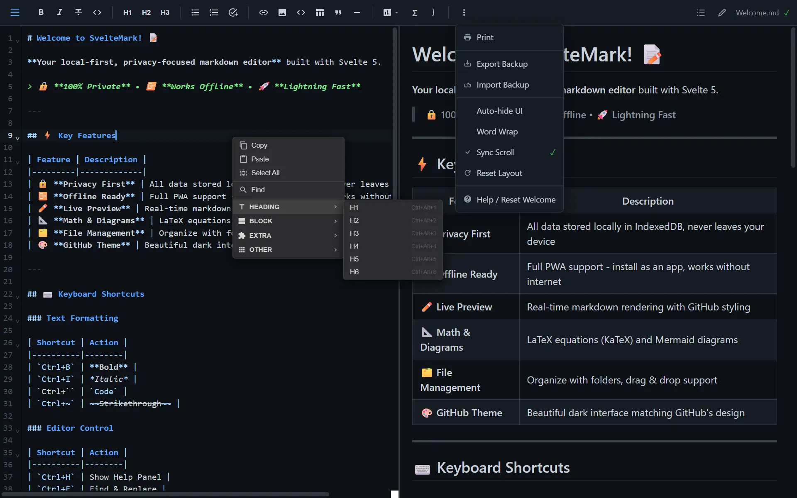

<div align="center">


# SvelteMark

A **privacy-first**, **open-source**, **local-only** markdown editor built with Svelte 5.

Your notes never leave your device. No accounts. No tracking. No cloud.

[](https://sm.fana.my.id)
[](LICENSE)
[](https://svelte.dev/)

</div>

---

  

<!-- TODO: Add actual screenshot -->

## ✨ Features

### 🔒 Core Philosophy
*   **Local-First Architecture:** 100% of data lives in your browser's IndexedDB via Dexie.js.
*   **Privacy Focused:** Zero telemetry, no server uploads, no account required.
*   **Offline Ready:** Full PWA support. Install it on your device and write without internet.

### ⚡ Editor Capabilities
*   **Live Preview:** Real-time rendering with **CodeMirror 6**.
*   **Smart Scroll Sync:** Bi-directional scrolling matches your editor and preview perfectly.
*   **Rich Content:**
    *   **Diagrams:** Native [Mermaid.js](https://mermaid.js.org/) support (Flowcharts, Sequence, Gantt).
    *   **Math:** LaTeX equations via [KaTeX](https://katex.org/).
    *   **GFM:** Full GitHub Flavored Markdown support (Tables, Task lists, etc).
*   **File System:** Hierarchical file tree with drag-and-drop organization.

### 🛠️ Tools
*   **Backup & Restore:** One-click JSON export of your entire database.
*   **Distraction Free:** Auto-hiding UI and "View Only" modes.
*   **Vim Mode:** (Coming soon/Supported via CodeMirror).
*   **Print Ready:** CSS optimized for beautiful PDF exports (`Ctrl+P`).

---


## 📸 Screenshots

### Editor with Live Preview


_Split-view editor with live markdown preview, file explorer on the left_

### Markdown Preview with GitHub Styling


_Beautiful rendered markdown with GitHub-style formatting_

### File Explorer & Organization


_Hierarchical file and folder organization with drag-and-drop support_

### Formatting Toolbar & Context Menu


_Comprehensive formatting options via toolbar and right-click context menu_

### Help & Keyboard Shortcuts


_Built-in help system with all keyboard shortcuts and markdown examples_

## Getting Started

### Prerequisites

- [Node.js](https://nodejs.org/) v18 or higher
- [pnpm](https://pnpm.io/) (recommended) or npm/yarn
- Modern web browser with IndexedDB support

### Quick Start

---

## 🚀 Getting Started

```bash
# Clone the repository
git clone https://github.com/MasFana/sveltemark.git
cd sveltemark

# Install dependencies
pnpm install

# Start development server
pnpm dev
```

Open [http://localhost:5173](http://localhost:5173) in your browser.

### Building for Production

```bash
# Build the application
pnpm build

# Preview the production build
pnpm preview
```

## ⌨️ Keyboard Shortcuts

### Text Formatting

| Shortcut       | Action                 |
| -------------- | ---------------------- |
| `Ctrl+B`       | **Bold** text          |
| `Ctrl+I`       | _Italic_ text          |
| Ctrl+`       | \`Inline code\`        |
| `Ctrl+~` | ~~Strikethrough~~ text |
| `Ctrl+Shift+.`   | Numbered list          |
| `Ctrl+.`   | Bullet list            |
| `Ctrl+Q`   | Block quote            |

### Editor Control

| Shortcut    | Action                            |
| ----------- | --------------------------------- |
| `Ctrl+H`    | **Show keyboard shortcuts panel** |
| `Ctrl+F`    | **Find and replace**              |
| `Ctrl+P`    | **Print document**                |
| `Ctrl+S`    | Save now                          |
| `Ctrl+/`    | Toggle comment                    |
| `Tab`       | Indent line                       |
| `Shift+Tab` | Outdent line                      |

### View & Navigation

| Shortcut       | Action                       |
| -------------- | ---------------------------- |
| `Ctrl+Shift+P` | Toggle preview mode          |
| `Ctrl+Alt+D`   | Toggle distraction-free mode |
| `Ctrl+0`       | Reset zoom                   |
| `F11`          | Enter fullscreen             |

### Multi-Select & Selection

| Shortcut       | Action                 |
| -------------- | ---------------------- |
| `Ctrl+A`       | Select all             |
| `Ctrl+D`       | Select next occurrence |
| `Ctrl+Shift+L` | Select all occurrences |

## Tech Stack

- **Framework**: [Svelte 5](https://svelte.dev/) with Runes
- **Build Tool**: [Vite](https://vitejs.dev/)
- **Editor**: [CodeMirror 6](https://codemirror.net/)
- **Database**: [Dexie.js](https://dexie.org/) (IndexedDB wrapper)
- **Markdown Processing**:
  - [unified](https://unifiedjs.com/) ecosystem
  - [remark-gfm](https://github.com/remarkjs/remark-gfm) - GitHub Flavored Markdown
  - [remark-math](https://github.com/remarkjs/remark-math) + [rehype-katex](https://github.com/remarkjs/remark-math/tree/main/packages/rehype-katex) - Math equations
  - [rehype-highlight](https://github.com/rehypejs/rehype-highlight) - Code syntax highlighting
- **Diagrams**: [Mermaid](https://mermaid.js.org/)
- **Styling**: [github-markdown-css](https://github.com/sindresorhus/github-markdown-css)
- **Deployment**: [Cloudflare Pages](https://pages.cloudflare.com/) (optional)
- **Offline**: Service Worker with cache-first strategy for PWA support

## Project Structure

```
fanadown/
├── src/
│   ├── lib/
│   │   ├── components/
│   │   │   ├── Editor.svelte      # CodeMirror editor component
│   │   │   ├── Preview.svelte     # Markdown preview component
│   │   │   ├── Sidebar.svelte     # File explorer sidebar
│   │   │   ├── FileTree.svelte    # Recursive file tree
│   │   │   └── Toolbar.svelte     # Formatting toolbar
│   │   ├── appState.svelte.ts     # Global reactive state
│   │   ├── db.ts                  # Dexie database operations
│   │   ├── markdown.ts            # Markdown processing pipeline
│   │   └── index.ts               # Library exports
│   ├── service-worker.ts          # PWA offline caching
│   └── routes/
│       ├── +layout.svelte         # App layout
│       └── +page.svelte           # Main page
├── static/                        # Static assets
├── package.json
├── svelte.config.js
├── vite.config.ts
└── tsconfig.json
```

## Data Storage

SvelteMark uses **IndexedDB** via Dexie.js for local-first data storage. All your notes are stored in your browser and never leave your device.

### Database Schema

- **folders**: `id, name, parentId, isOpen`
- **files**: `id, folderId (nullable), title, content, createdAt, updatedAt`

> Note: `folderId` can be `null` for root-level files (files not inside any folder).

### Export/Import

You can export all your data as a JSON file for backup:

1. Click the **⋯** (More) menu in the toolbar
2. Select **Export Backup**
3. Save the JSON file

To restore:

1. Click **Import Backup**
2. Select your backup JSON file

## Offline Mode

SvelteMark works fully offline as a Progressive Web App (PWA).

### How It Works

- **Service Worker**: Caches all app assets on first visit
- **Cache-First Strategy**: Assets are served from cache instantly
- **Background Updates**: New versions are fetched automatically when online
- **Data Persistence**: Your notes are stored locally in IndexedDB

### Installing as PWA

1. Visit the app in Chrome, Edge, or Safari
2. Click the install icon in the address bar (or "Add to Home Screen" on mobile)
3. Launch from your desktop or home screen
4. Works offline - no internet required!

### Notes

- First visit requires internet to download the app
- After installation, the app works completely offline
- Updates are applied automatically when you're back online
- All data stays local - nothing is sent to servers even when online


## Contributing

Contributions are welcome! Please feel free to submit a Pull Request.

1. Fork the repository
2. Create your feature branch (`git checkout -b feature/AmazingFeature`)
3. Commit your changes (`git commit -m 'Add some AmazingFeature'`)
4. Push to the branch (`git push origin feature/AmazingFeature`)
5. Open a Pull Request

## License

This project is licensed under the MIT License - see the [LICENSE](LICENSE) file for details.

## Acknowledgments

- [Svelte](https://svelte.dev/) - The amazing reactive framework
- [CodeMirror](https://codemirror.net/) - The versatile code editor
- [GitHub](https://github.com/) - Design inspiration for the dark theme
- [ByteMD](https://bytemd.js.org/) / [StackEdit](https://stackedit.io/) - Scroll sync inspiration

---

Made with Svelte 5 | Open Source | Privacy First
